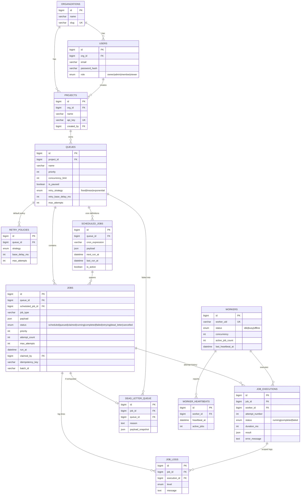

# Entity-Relationship Diagram

See `database/schema.sql` for the full DDL with column-level comments. This
is the logical shape of it:

## Key normalization / denormalization choices

- **3NF for relational fields.** Status, priority, timestamps, foreign keys
  are all real, indexed, typed columns — never buried in JSON — because
  they're what the poll query, dashboards, and filters query on constantly.
- **JSON only for opaque, heterogeneous data.** `jobs.payload` and
  `job_executions.result` are the only JSON columns, because job payloads
  are defined by whatever the job type needs (an email job's payload looks
  nothing like a report-generation job's) and forcing that into columns
  would mean either a giant sparse table or an EAV anti-pattern.
- **`job_executions` is separate from `jobs`,** one row per attempt, so the
  full retry history (which worker ran it, how long each attempt took, what
  each attempt's error was) survives independently of the job's current
  state. `jobs` itself only carries the *current* attempt count/status.
- **`dead_letter_queue` is a distinct table**, not just a `jobs.status`
  value, so it can carry DLQ-specific metadata (a payload *snapshot* at
  time of failure, a requeued_at audit column) without polluting the hot
  `jobs` table's schema.
